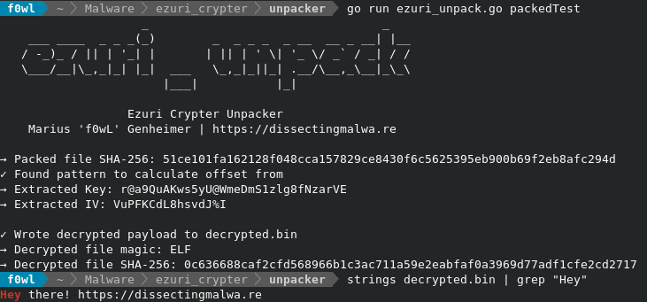
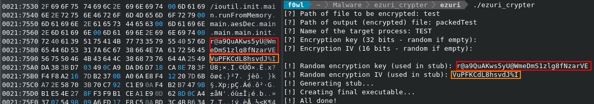

# ezuri_unpack

A simple unpacking script for the Ezuri ELF Crypter. Based on the analysis done by Ofer Caspi and Fernando Martinez of AT&T Alien Labs: [https://cybersecurity.att.com/blogs/labs-research/malware-using-new-ezuri-memory-loader](https://cybersecurity.att.com/blogs/labs-research/malware-using-new-ezuri-memory-loader)



<br>

## How does it work?

The payload is encrypted with AES CFB and will be decrypted and run via memfd_create by the stub. Key and IV are stored in the binary.



<br>

## Testing the script

1. Build the test payload ```gcc test.c -o test```
2. Build and run [guitmz/ezuri](https://github.com/guitmz/ezuri)
3. To unpack it again: ```go run ezuri_unpack.go packed.bin```

I also tested it with the packed Linux.Cephei sample mentioned in the report. [Link to Virustotal](https://www.virustotal.com/gui/file/ddbb714157f2ef91c1ec350cdf1d1f545290967f61491404c81b4e6e52f5c41f/detection)
